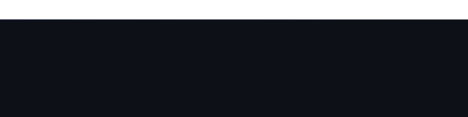

<h1 align="center">
    
</h1>

<h3 align="center">A passionate software developer from Pakistan.</h3>

 

 
 🔭 I’m currently working on **Data Science and AI**
 
 🌱 I’m currently learning **Generative AI**

💬 Ask me about **Python,Machine Learning,Deep Learning,NLP,openCv,Java ,C++**

⚡ Fun fact **I'm a passionate cricket fan! Whether it's cheering for my favorite team or analyzing every play, you'll often find me immersed in the world of cricket during my free time. 🏏
**

 

 

 
  
  
  

 

 
<h2 align="center">⚒️ Languages-Frameworks-Tools ⚒️</h2>
 

    
     

 

  <h2>🐍 My Contributions 🐍</h2>
   
  
  
     

<h2 align="center">⚡ Stats ⚡</h2>
 

  
  
   
  

  

 

 
